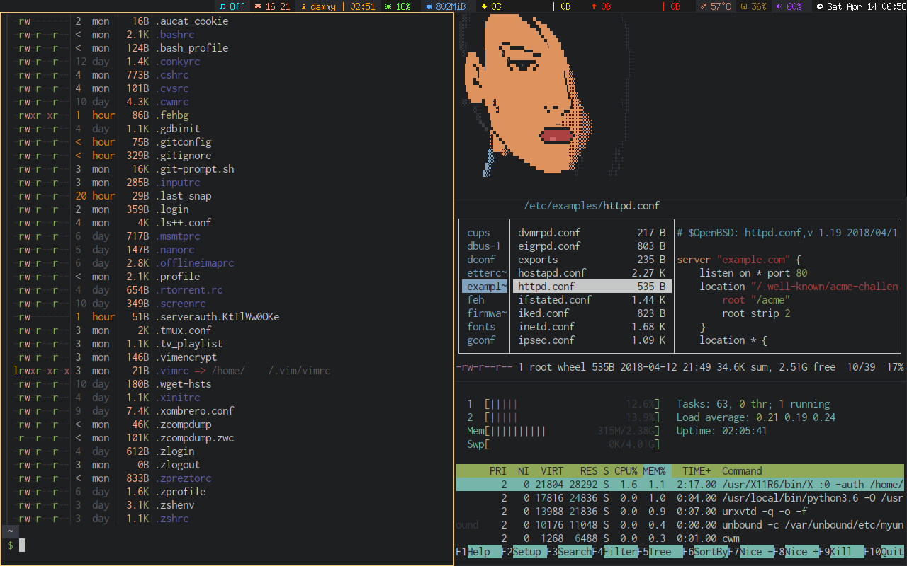
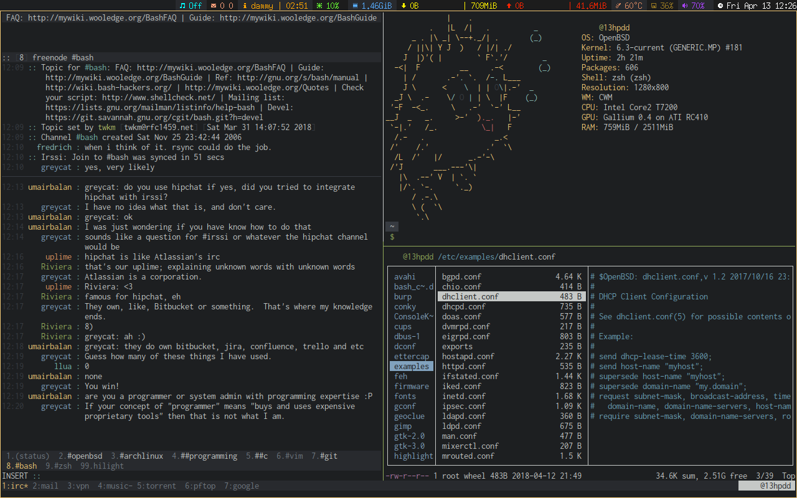
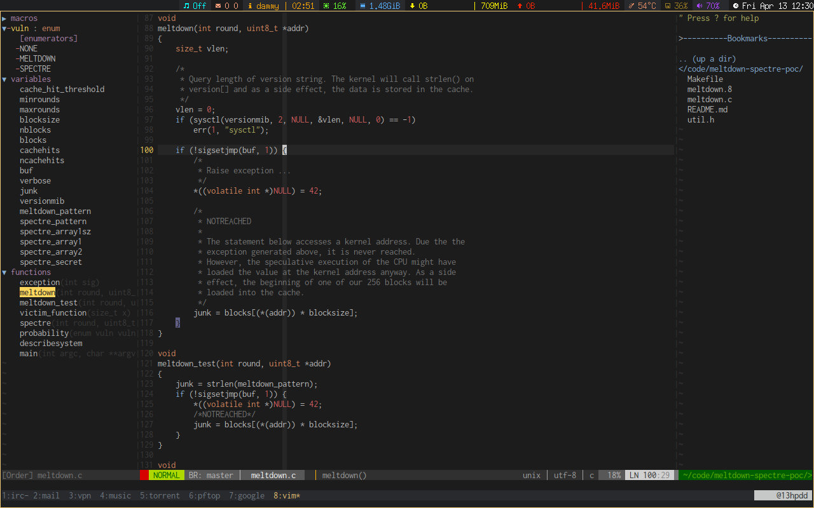
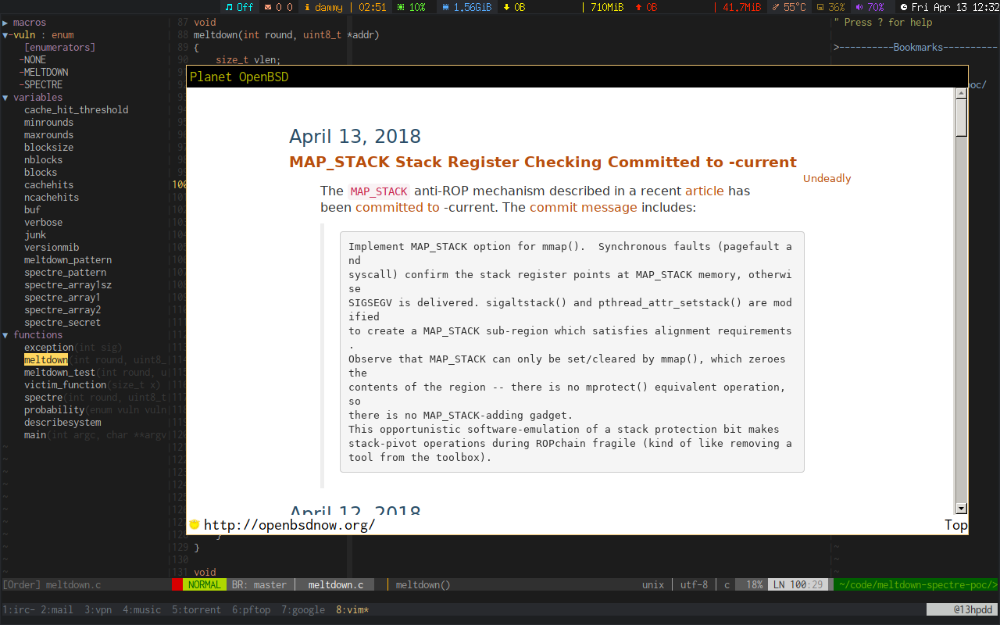

#Thinkpad x200
#OpenBSD-current
______________________________________________________________________________
|WM/DE|SHELL|TERM |Editor|FileManager|Multiplexer|Audio|Mail|IRC  |Monitor   |
|-----|-----|-----|------|-----------|-----------|-----|----|-----|----------|
|CWM  |ksh  |urxvt|vim   |ranger     |tmux       |cmus |mutt|irssi|conky,dzen|
------------------------------------------------------------------------------

#Screenshots

#Mount MFS (622e43df6306aafc.b swap)
% mkdir /tmp/memarea
% mount_mfs -s 524288 622e43df6306aafc.b /tmp/memarea

#OpenBSD INSTALL (keydisk)
% fdisk -iy sd0
% disklabel -E sd0
>z
>a a size 70M 
>a b size 32M
>a d RAID full
>w
>q

% disklabel -E sd2
>z
>a d size 1M RAID
>a a full 4.2BSD
>w
>q
% newfs /dev/rsd0a
% bioctl -c C -r 999999999 -l /dev/sd0d -k /dev/sd2d softraid0

% install
disk size 160GB(total)
a /          5GB
d /tmp       4GB
f /usr       4GB
g /usr/X11R6 1GB
h /usr/local 10GB
j /usr/obj   2GB
i /usr/src   2GB
e /var       9GB 
b swap       4GB
k /home      %100

enter
disk
mounted no
sd1
enter
enter
enter
enter
yes

% mount /dev/sd0a /mnt2
% cp -v /mnt/bsd* /mnt2
% reboot

#ADD: softdep,noatime
622e43df6306aafc.b none swap sw
622e43df6306aafc.a / ffs rw,softdep,noatime 1 1
622e43df6306aafc.k /home ffs rw,softdep,noatime,nodev,nosuid 1 2
622e43df6306aafc.d /tmp ffs rw,softdep,noatime,nodev,nosuid 1 2
622e43df6306aafc.f /usr ffs rw,softdep,noatime,nodev 1 2
622e43df6306aafc.g /usr/X11R6 ffs rw,softdep,noatime,nodev 1 2
622e43df6306aafc.h /usr/local ffs rw,softdep,noatime,wxallowed,nodev 1 2
622e43df6306aafc.j /usr/obj ffs rw,softdep,noatime,nodev,nosuid 1 2
622e43df6306aafc.i /usr/src ffs rw,softdep,noatime,nodev,nosuid 1 2
622e43df6306aafc.e /var ffs rw,softdep,noatime,nodev,nosuid 1 2
622e43df6306aafc.b /tmp/memarea mfs rw,async,-s=524288 0 0

